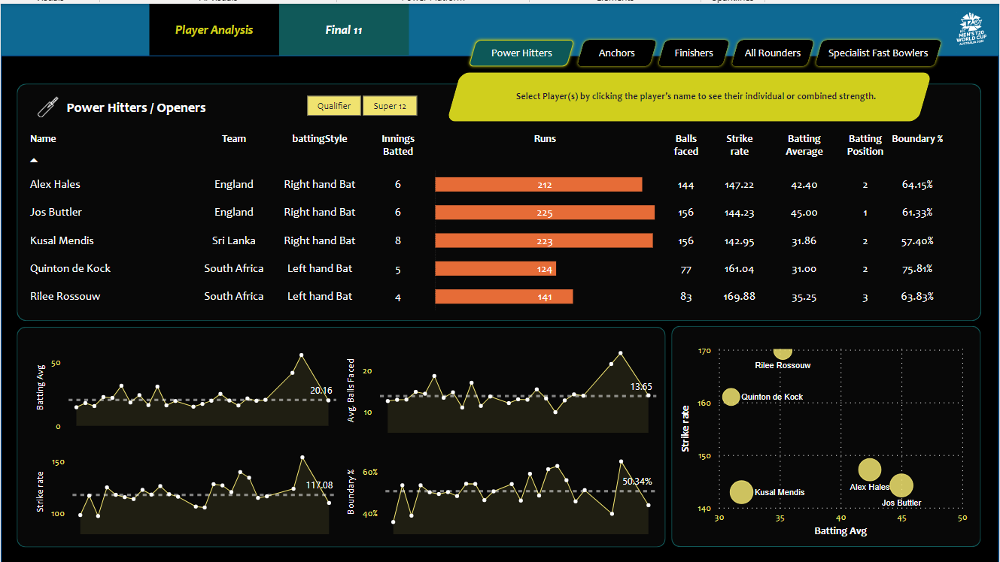
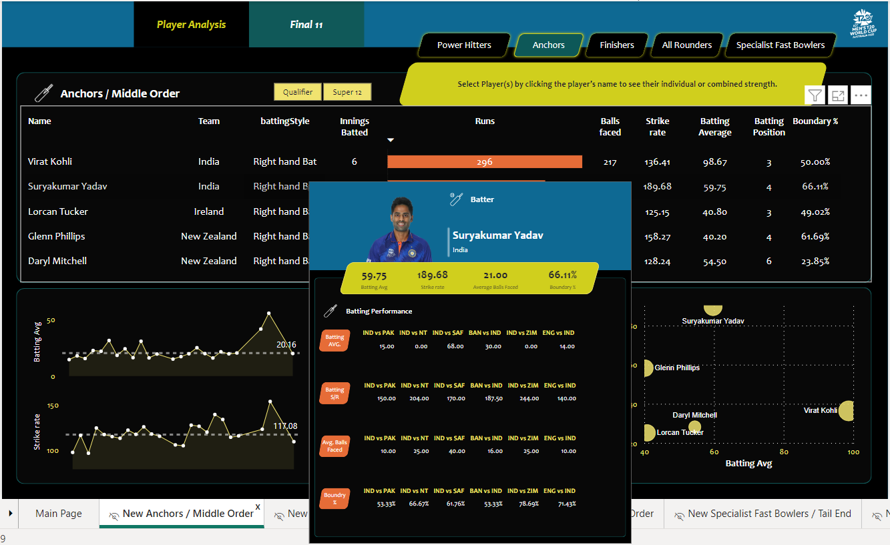
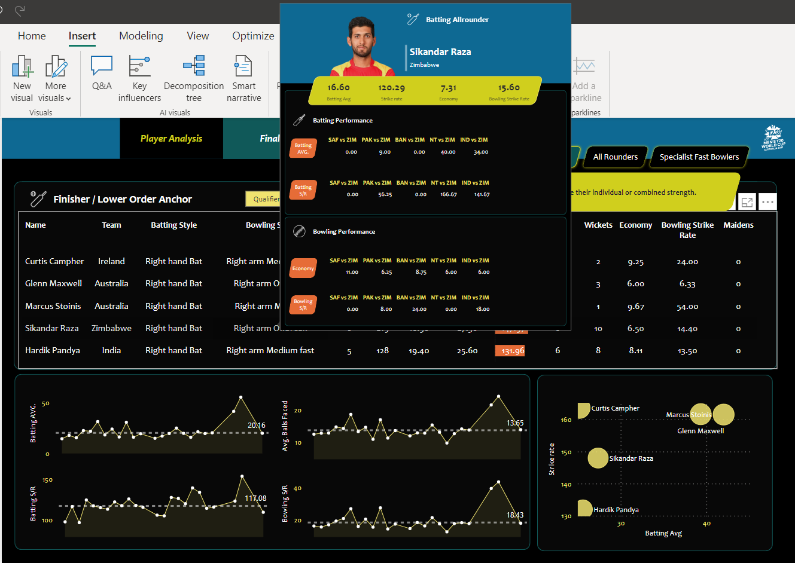
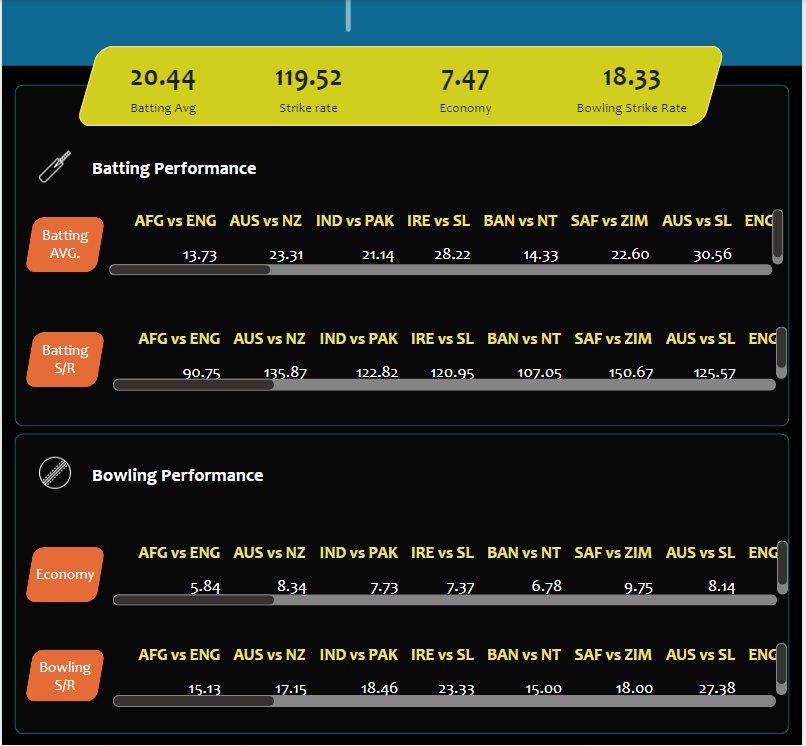
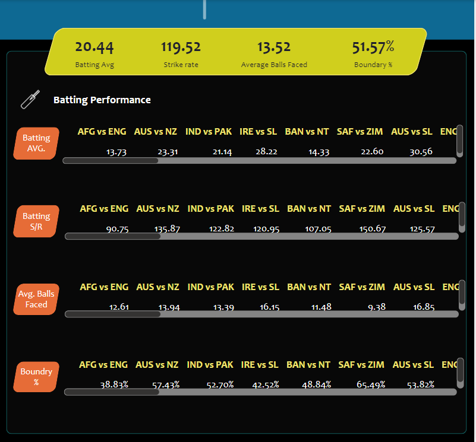
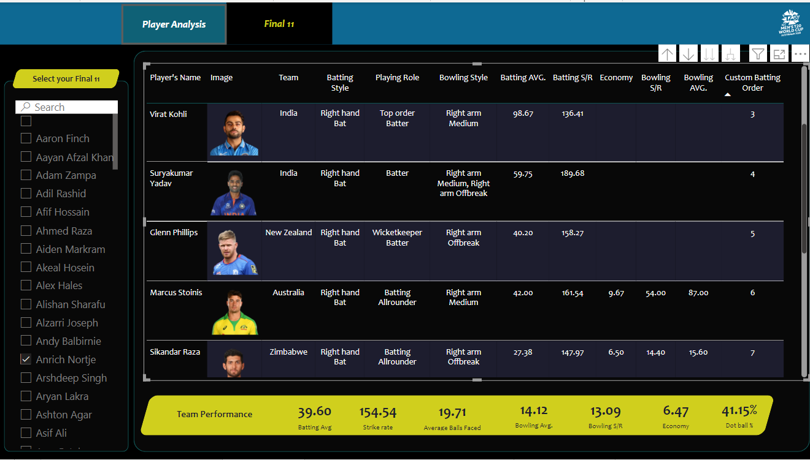

# Cricket Data Insights 🏏

---

Welcome to the world of Cricket Data Insights! 🏏 This project is centered around the T-20 Cricket World Cup data analysis. Utilizing the prowess of **Power BI**, I've created an interactive and insightful dashboard. This dashboard empowers cricket enthusiasts to delve into match data from the world cup, perform comprehensive analyses, and even form their ideal playing XI from the pool of talented players competing in the tournament.

> For an interactive experience with the dashboard, you can download the PBIX file from the repository and open it in Power BI Desktop on your local machine.

---

# Project Journey:

1. 📝 Requirement Identification
2. 🌐 Data Extraction through Web Scraping from [ESPN Cricinfo](http://www.espn.in/cricket/) website
3. 🧹 Data Cleansing and Preprocessing using Pandas
4. 🪄 Data Transformation employing Power Query
5. ⚒️ Data Modeling and Parameterization within Power BI using DAX
6. 📊 Dashboard Construction in Power BI

---

# Dashboard Highlights:

Join us in this exhilarating journey through cricket data, where insights meet excitement on the pitch! 🏆

